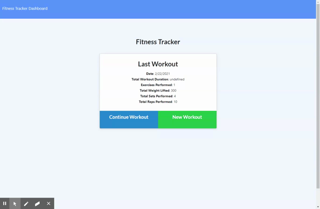

# Working It OUt

## Description
This is an application that allows a user to view, create, and track daily workouts. It was created using a Mongo database with a Mongoose schema and enables handle routes with Express.

Application was deployed on Heroku using MongoDB Atlas, however connecting MongoDB to the Heroku application is a process I have yet to accomplish, so I recommend installing and running the application via your local machine with instructions below.

## Installation

### From your local machine
- Clone the repository, then in order to run, install the dependencies by typing in your terminal:
```
npm install
```
Then run the server by:
```
npm start
```
In your web browser, search for:
```
localhost:3000
```

### From the deployed web application
No installation is necessary. Please access the deployed app by visiting: [https://guarded-cove-82204.herokuapp.com/](https://guarded-cove-82204.herokuapp.com/)

## Usage
To view a video demo, click [here](https://drive.google.com/file/d/1sxSolUsU_rRQpcfY7EzaUHiRiYzBTTjQ/view).



## License
 MIT License

Copyright (c) 2021 Jonnah Marie Pangilinan

Permission is hereby granted, free of charge, to any person obtaining a copy
of this software and associated documentation files (the "Software"), to deal
in the Software without restriction, including without limitation the rights
to use, copy, modify, merge, publish, distribute, sublicense, and/or sell
copies of the Software, and to permit persons to whom the Software is
furnished to do so, subject to the following conditions:

The above copyright notice and this permission notice shall be included in all
copies or substantial portions of the Software.

THE SOFTWARE IS PROVIDED "AS IS", WITHOUT WARRANTY OF ANY KIND, EXPRESS OR
IMPLIED, INCLUDING BUT NOT LIMITED TO THE WARRANTIES OF MERCHANTABILITY,
FITNESS FOR A PARTICULAR PURPOSE AND NONINFRINGEMENT. IN NO EVENT SHALL THE
AUTHORS OR COPYRIGHT HOLDERS BE LIABLE FOR ANY CLAIM, DAMAGES OR OTHER
LIABILITY, WHETHER IN AN ACTION OF CONTRACT, TORT OR OTHERWISE, ARISING FROM,
OUT OF OR IN CONNECTION WITH THE SOFTWARE OR THE USE OR OTHER DEALINGS IN THE
SOFTWARE.